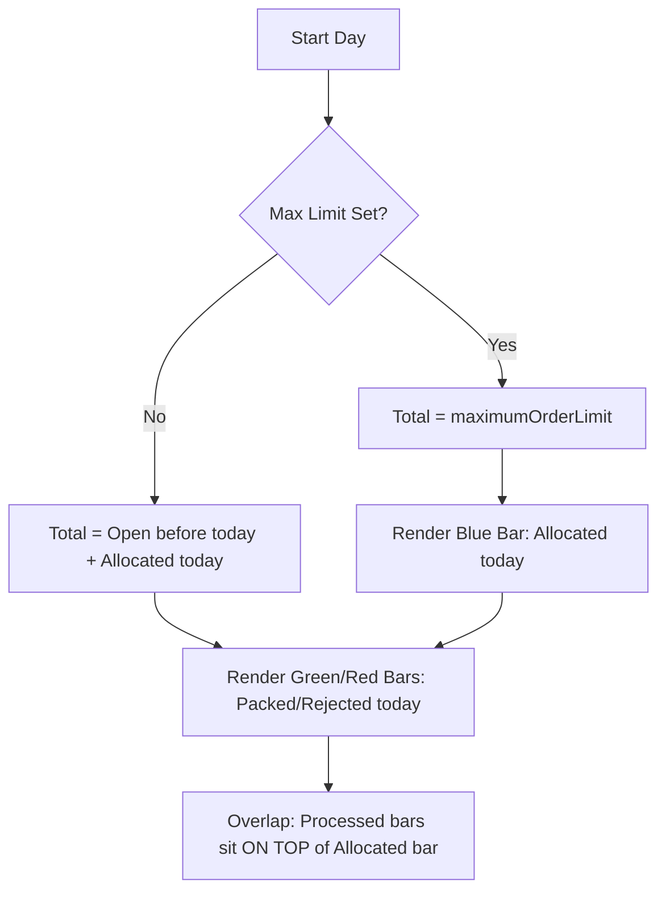

# Fulfillment Progress Bar Requirements

The Fulfillment Progress Bar provides a visual representation of a store's daily fulfillment performance and capacity utilization.

## 1. Frame of Reference (Total Capacity)

The "Total" or width of the bar is determined by the facility's configuration:

| Scenario | Calculation for `Total` |
| :--- | :--- |
| **Max Capacity Set** | The `maximumOrderLimit` defined for the facility. |
| **No Capacity Set** | `Open Orders (Assigned before today)` + `Orders allocated today`. |

## 2. Visual Representation (Layers)

The chart uses overlapping layers rather than a simple stacked approach to show progress *within* the allocated capacity.

### Layer 1: Allocated Orders (Background)
- **Condition**: ONLY rendered if a explicit `maximumOrderLimit` is defined for the facility.
- **Color**: Semi-transparent Blue (`#3880FF` with opacity).
- **Measurement**: Number of orders allocated to the facility **today**.
- **Purpose**: Shows how much of the total capacity has been "consumed" by assignments.

### Layer 2: Processed Orders (Foreground)
- **Color**: 
  - **Green**: Orders packed today.
  - **Red**: Orders rejected today.
- **Behavior**: These bars **overlap** the Blue Allocated bar. They represent the progress made on the orders that were allocated.
- **Purpose**: Shows how many of the allocated orders have actually been completed.

### Layer 3: Remaining Capacity (Track)
- **Color**: White/Light Gray.
- **Measurement**: `Total` - (`Allocated Today` + `assignedBeforeToday`).
- **Purpose**: Shows the remaining room for more allocations.

## 3. Implementation Logic (Summary)

## 4. Technical Implementation Details

### Data Fetching Strategy
To support the "Frame of Reference" logic, we need to distinguish between orders assigned today and those assigned previously:

1.  **Allocated Today**: Fetch from `OrderFacilityChange` with `changeDatetime_from` set to the start of today.
2.  **Assigned Before Today**: Fetch from `OrderHeaderItemShipGroupShipment` (or equivalent) with `reservedDatetime_to` set to the start of today and status restricted to `ORDER_APPROVED` or similar open statuses.
3.  **Packed/Rejected Today**: Existing logic in `Dashboard.vue` is sufficient (`ShipmentAndStatus` and `OrderFacilityChange` filtered by today).

### Chart.js Layering Strategy
To achieve the **overlapping** effect where Processed bars sit on top of the Allocated bar:
- **Dataset 1 (Base/Total)**: A background "track" dataset spanning the full `Total`.
- **Dataset 2 (Allocated)**: A semi-transparent blue bar.
- **Dataset 3 (Processed)**: A stacked group (Green + Red) that occupies the same horizontal space.
- **Overlay Method**: Use two separate `datasets` in Chart.js. By setting `stack: 'processed'` for Green/Red and `stack: 'allocated'` for Blue (or using a single stack with specific order), we can control the visual overlap. Alternatively, we can use a single stack and calculate the "unused allocated" space as a transparent segment to ensure the green/red sits correctly within the blue area.

## 5. Visual Specifics
- **Opacity**: Blue bar should have ~40-50% opacity to clearly distinguish it from the solid Green/Red "completed" portions.
- **Rounding**: Corner rounding (16px) should apply to the leftmost and rightmost visible edges of the combined progress.
